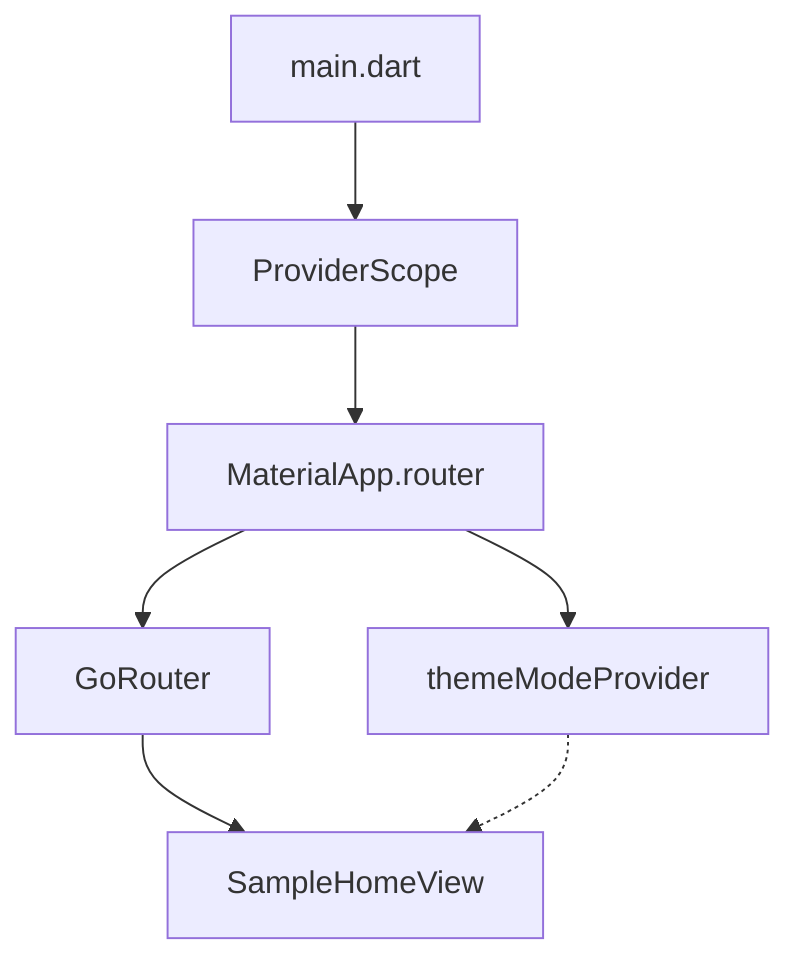

* architecture.md
* --------------------------
* Purpose: Explains the actual architecture, structure, and design decisions of the Flutter Riverpod base app.
* Author: Pablo Fuertes
* Usage: Reference for contributors and maintainers to understand how the app is organized and why.

# Architecture

## Overview

This Flutter base app is designed for scalability, maintainability, and testability. It uses [Riverpod](https://riverpod.dev) for state management and [GoRouter](https://pub.dev/packages/go_router) for navigation. The structure enforces separation of concerns and modularity.

---

## Architectural Pattern

The app follows a modular, feature-first approach:

- **Views**: Each screen/view is in its own folder under `lib/views/{view_name}/{view_name}.dart`.
- **Providers**: All state management logic is in `lib/providers/{provider_name}/{provider_name}_provider.dart`.
- **Routing**: Centralized using GoRouter in `main.dart`.
- **Theme & Global State**: Managed via Riverpod providers.

### Diagram

---

## Directory Structure

- `lib/main.dart`: App entry point. Sets up Riverpod, routing, and theme.
- `lib/views/`: Contains all UI screens. Each view has its own folder and main widget file.
    - Example: `lib/views/sample_home_view/sample_home_view.dart`
- `lib/providers/`: Contains all Riverpod providers, each in its own folder.
    - Example: `lib/providers/theme_mode_provider/theme_mode_provider.dart`
- `documentation/`: Project documentation.
- `architecture/`: This file and any architecture diagrams.

---

## State Management (Riverpod)

- **ProviderScope** wraps the app in `main.dart`.
- Providers are created as Dart files in `lib/providers/{provider_name}/{provider_name}_provider.dart`.
- Example: [`themeModeProvider`](../lib/providers/theme_mode_provider/theme_mode_provider.dart:1) manages the app's theme mode using a `StateNotifierProvider`.
- Views consume providers using `ConsumerWidget` or `Consumer`.

**Best Practices:**
- Keep business logic in providers, not in views.
- Use `StateNotifierProvider` for mutable state, `Provider` for computed values, etc.

---

## Navigation (GoRouter)

- Configured in `main.dart` using `GoRouter`.
- All routes are defined centrally.
- Example: `/` route points to [`SampleHomeView`](../lib/views/sample_home_view/sample_home_view.dart:1).

---

## Error Handling

- Handle errors at the provider level using Riverpod's async/error handling.
- Display error states in views as needed.

---

## Testing

- Providers can be unit tested independently.
- Views can be tested as widgets.
- Use `flutter_test` and `riverpod_test` for best results.

---

## Code Style and Linting

- Follows Dart and Flutter best practices.
- Uses `flutter_lints` as defined in [`analysis_options.yaml`](../analysis_options.yaml:1).

---

## Key Design Decisions

- **Riverpod** chosen for robust, testable state management.
- **GoRouter** for declarative, scalable navigation.
- **Feature-first structure** for modularity and clarity.
- **Strict documentation and file structure rules** for maintainability.

---